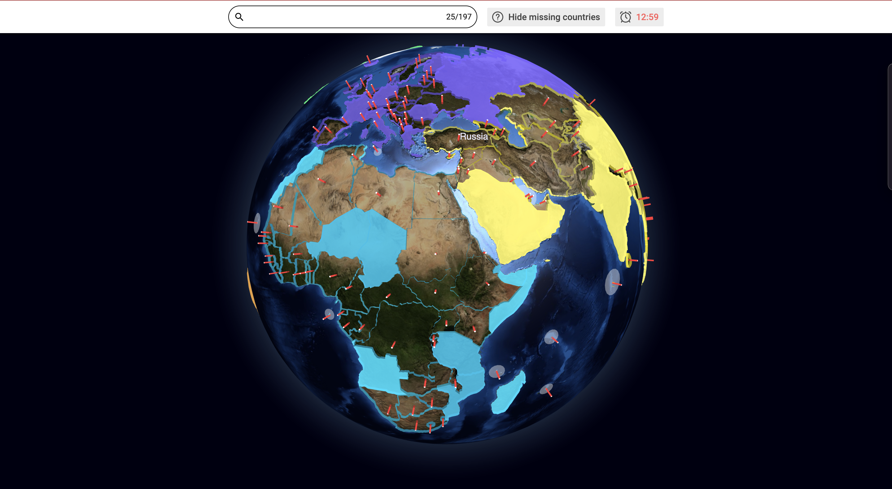
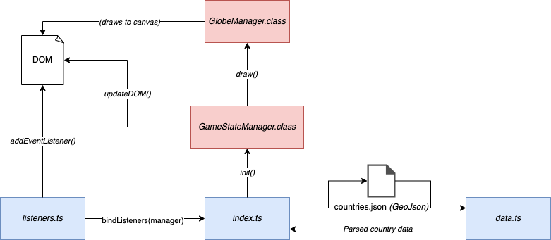

## COTW
### Countries of the world game



#### Technologies

The application runs on the web, and supports mobile webviews and controls. To achieve this, the following is used:

1. [TypeScript](https://www.typescriptlang.org/)
2. [Globe.GL library](https://globe.gl/) (Globe API for THREE.js)
3. [Parcel](https://parceljs.org/) (buildtool)

#### Prerequisites

1. [Yarn](https://yarnpkg.com/) (run dev/build commands)
2. [AWS CLI](https://aws.amazon.com/cli/) (deploy/push to ECS)

#### Build/run commands

Begin by installing all dependencies:

```sh
yarn
```

You can then run the project locally:

```sh
yarn dev
```

*NOTE* There is currently a limitation due to file serving that the value of `NGINX_SERVE` must be set to `false` in `src/config.ts`
in order to run locally. More on this below.

You can also push a new image to ECS using the following command (keep in mind you need to have a valid auth session with AWS):

```sh
yarn push
```

#### Application components

Below is a high level diagram of how the application components work and the render cycle behaves.

